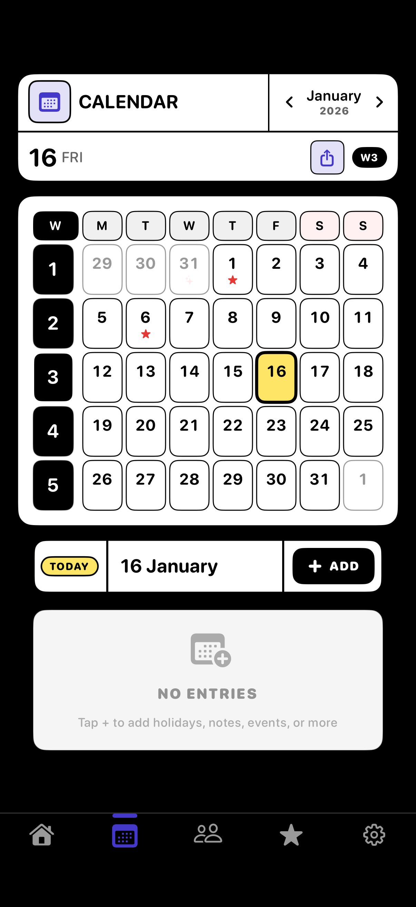
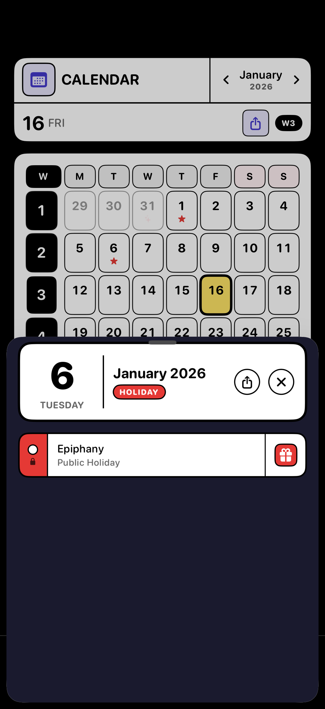
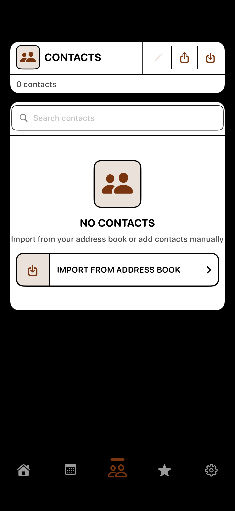
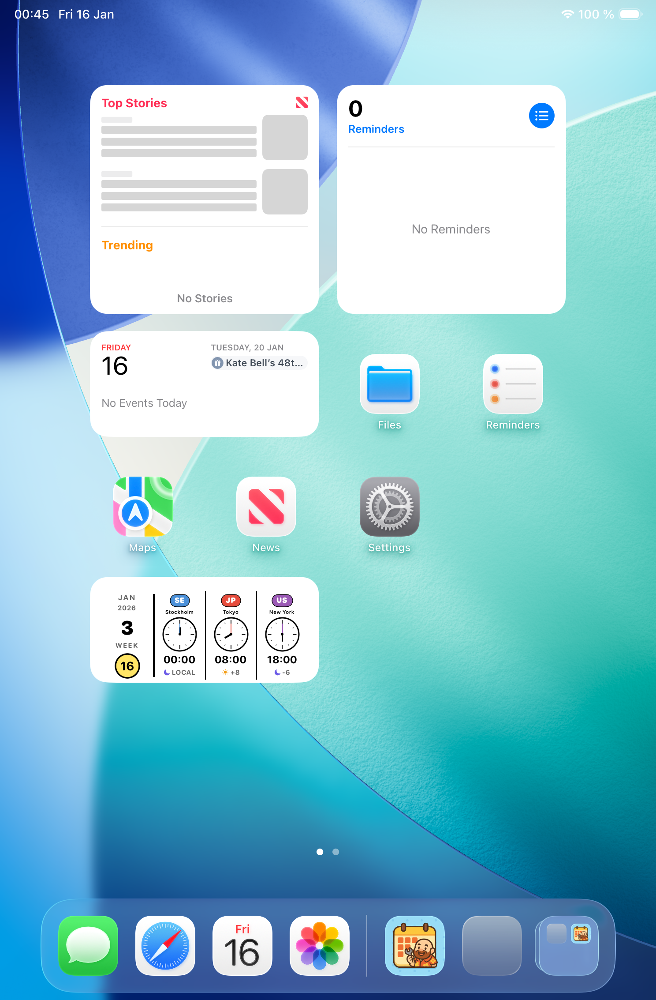

# Onsen Planner
## Professional Week Number Display

---

# Overview

**Onsen Planner** is an iOS 18+ productivity app that displays ISO 8601 week numbers with semantic color coding.

**Key Features:**
- Week number display following ISO 8601 standard
- Multi-country holiday support (16 countries)
- World clocks with visual time representation
- Contact management with birthday tracking
- Expense tracking with currency conversion
- PDF export capabilities

**Design System:** 情報デザイン (Jōhō Dezain) - Japanese Information Design

---

# Landing Page (ONSEN)

**Features:**
- **Current date display** with week number (W3)
- **World Clocks** showing times in multiple cities
  - Tokyo, London, New York with analog clock faces
  - Hour difference indicator (+8, -1, -6)
- **Today's schedule** at a glance
- **Glance tiles** with fun facts and statistics
  - Upcoming holidays
  - Week progress (3 of 52)
  - Month progress (51%)
  - Day of year (16 of 365)

---

# Calendar View

**Features:**
- **Month calendar** with week numbers in left column
- **ISO 8601 week calculation** (Monday start, W1 = first 4-day week)
- **Holiday indicators** with colored dots
- **Quick navigation** with month picker
- **Export menu** for Day/Week/Month PDF export
- **Long-press** on any day for detailed view

---

# Day Detail Sheet

**Appears on long-press of calendar day**

**Features:**
- **Date header** with day number, weekday, and month
- **Status pills** showing TODAY, HOLIDAY
- **Content sections** listing all items for the day:
  - Public Holidays (with region flag)
  - Observances (flag days)
  - Personal Events
  - Birthdays
  - Notes
  - Trips
  - Expenses
- **Export button** for PDF generation
- **System lock icon** for non-editable holidays

---

# Special Days (Star)

**Year overview of all special days**

**Features:**
- **Monthly grid view** with seasonal icons
- **Color-coded months** for visual interest
- **Holiday count summary** (13 holidays, 11 observances)
- **Quick stats** at top of screen
- **Globe button** for region selection
- **Tap month** to see detailed list

**Monthly Themes:**
- January: Snowflake (winter)
- February: Heart (Valentine's)
- May: Flowers (spring)
- June: Sun (summer)
- December: Gift (holidays)

---

# Contacts

**Contact management with birthday integration**

**Features:**
- **Birthday tracking** from device contacts
- **Upcoming birthdays** prominently displayed
- **Age calculation** ("TURNS 30" format)
- **Days until** countdown
- **Contact synchronization** with iOS Contacts
- **Export options** for contact directory

---

# Settings

**Customization options**

**Calendar Settings:**
- Show/hide holidays toggle
- Holiday region selection (up to 2 regions)

**Preferences:**
- Base currency selection for expense tracking

**Display:**
- Background color (Black, Navy, Soft)
- AMOLED-optimized true black option
- Light/Dark mode toggle

**Personalization:**
- Custom landing page title
- PDF title and footer customization

**World Clocks:**
- Add up to 3 world clocks
- Displays on landing page

---

# Export Features

**PDF Export available for:**
- Single day view
- Week overview
- Month summary
- Contact directory

**Access points:**
- Calendar page header menu
- Day detail sheet (long-press)
- Contacts list header

**Customization:**
- PDF title text
- Footer text (or page numbers only)

---

# Design Philosophy

## 情報デザイン (Jōhō Dezain)

**Japanese Information Design Principles:**

1. **Clarity over decoration** - No gradients or glass effects
2. **Semantic colors** - Each color has meaning
3. **Squircle corners** - iOS-native continuous curves
4. **Strong borders** - Clear content separation
5. **Rounded typography** - SF Pro Rounded throughout
6. **Black & white base** - Colors used intentionally

**Color Semantics:**
| Color | Meaning |
|-------|---------|
| Yellow | NOW - today, notes |
| Cyan | SCHEDULED - events, trips |
| Pink | CELEBRATION - holidays, birthdays |
| Green | MONEY - expenses |
| Purple | PEOPLE - contacts |

---

# Technical Specifications

**Platform:** iOS 18.0+

**Frameworks:**
- SwiftUI
- SwiftData
- WidgetKit
- EventKit

**Widget Sizes:**
- Small: Week number with semantic color
- Medium: Week + date range + countdown
- Large: Full 7-day calendar with events

**Deep Linking:**
- `vecka://today` → Current week
- `vecka://week/{number}/{year}` → Specific week
- `vecka://calendar` → Calendar view

---

# Supported Regions

**16 Countries with Holiday Support:**

| Region | Countries |
|--------|-----------|
| **Nordic** | Sweden, Norway, Denmark, Finland, Iceland |
| **Europe** | Germany, UK, France, Italy, Netherlands |
| **Asia** | Japan, China, Hong Kong, Thailand, Vietnam |
| **Americas** | United States |

**Maximum 2 regions selectable** for focused holiday display

---

# Thank You

**Onsen Planner**
Version 1.0

© 2025 The Office of Nils Johansson
All Rights Reserved

---
